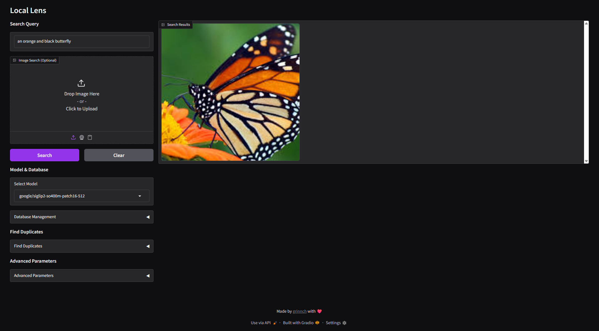

## Local Lens

Web application for finding images in your local directories using natural language queries or reverse image search. Powered by vision embedding models (e.g., CLIP/SigLIP 2).



## Features

- Index and update local image directories recursively using ChromaDB
- Perform targeted searches to retrieve relevant images or videos (text only, image only, text + image)
- Retrieve duplicate images
- Display search results in a gallery in order of confidence
- Web UI (Gradio)

## Requirements

- Python 3.10+
- PyTorch (CPU, CUDA, ROCm, MPS, XPU)

## Install

### Portable Package (Recommended)

Download the standalone zip from the releases page: [Portable Build](https://github.com/meangrinch/LocalLens/releases/tag/portable)

**Requirements:**

- **Windows:** Bundled Python/Git included; no additional requirements
- **Linux/macOS:** Python 3.10+ and Git must be installed on your system

**Setup:**

1. Extract the zip file
2. Run the setup script for your platform:
   - **Windows:** Double-click `setup.bat`
   - **Linux/macOS:** Run `./setup.sh` in terminal
3. The setup wizard will:
   - Detect your GPU and install the appropriate PyTorch version
   - Install all required dependencies
   - Create a launcher script (`start-webui.bat` or `start-webui.sh`)

> [!TIP]
> In the event that you need to transfer to a fresh portable package:
>
> - You can safely move the `img_db` directory to the new portable package
> - You might be able to move the `runtime` directory over, assuming the same setup configuration is wanted

### Manual install

1. Clone and enter the repo

```bash
git clone https://github.com/meangrinch/LocalLens.git
cd LocalLens
```

2. Create and activate a virtual environment (recommended)

```bash
python -m venv venv
# Windows PowerShell/CMD
.\venv\Scripts\activate
# Linux/macOS
source venv/bin/activate
```

3. Install PyTorch (see: [PyTorch Install](https://pytorch.org/get-started/locally/))

```bash
# Example (CUDA 13.0)
pip install torch==2.9.1+cu130 torchvision==0.24.1+cu130 --extra-index-url https://download.pytorch.org/whl/cu130
# Example (CPU)
pip install torch torchvision
```

4. Install dependencies

```bash
pip install -r requirements.txt
```

## Usage

### Web UI (Gradio)

1. Select a model (automatically downloads to hugging face cache `~/.cache/huggingface/hub`)
2. Add image directories to your Chroma database (via the "Database Management" dropdown in the UI, or via CLI)
3. Enter your search query (e.g., "an orange and black butterfly") and/or upload an image (for reverse image search/combined text + image search)
4. The application will display the results in order of confidence
5. Update/sync indexed directories if necessary

### Find duplicates

Click "Find Duplicates" in the UI with a specified indexed image directory to return similar matching images pairs.

## Updating

### Portable Package

- **Windows:** Run `update.bat` from the portable package root
- **Linux/macOS:** Run `./update.sh` from the portable package root

### Manual Install

From the repo root:

```bash
git pull
pip install -r requirements.txt  # Or activate venv first if present
```

## License & credits

- License: Apache-2.0 (see [LICENSE](LICENSE))
- Author: [grinnch](https://github.com/meangrinch)
- Inspired by [Where's My Pic?](https://github.com/Om-Alve/Wheres_My_Pic) by [@Om-Alve](https://github.com/Om-Alve)
